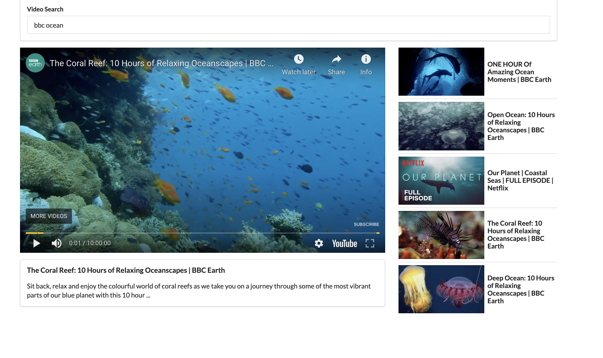
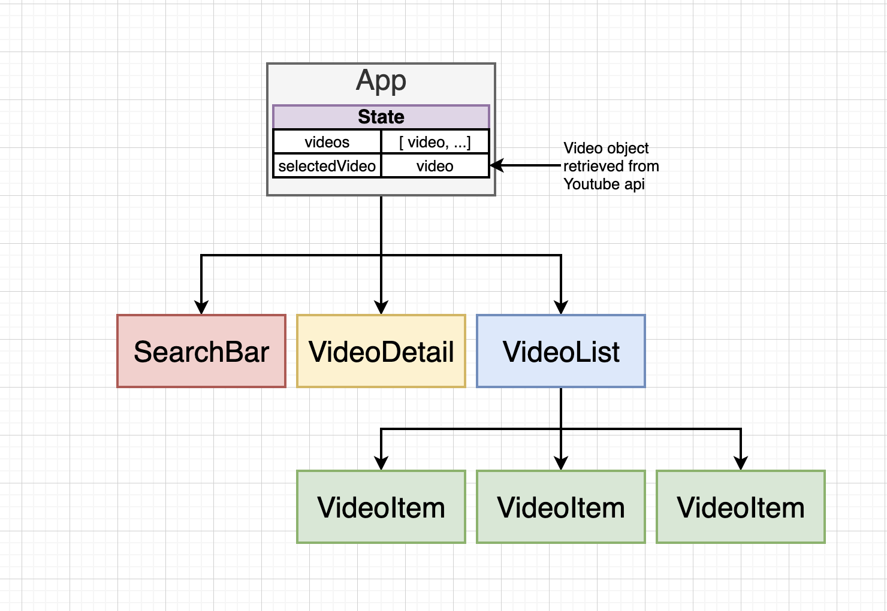
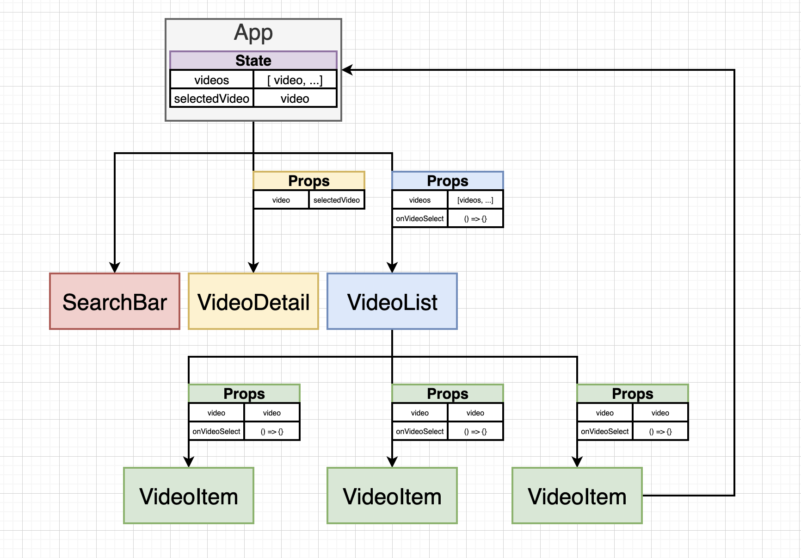

# Video Player

This application is a simplified version of the youtube video browser. It allows a user to enter a search term, connects to the [youtube v3 api](https://developers.google.com/youtube/v3/docs) to return the top 5 video results for the indicated term, and allows the user to play videos directly from the webpage

## Component Flow

## More Detailed component flow

